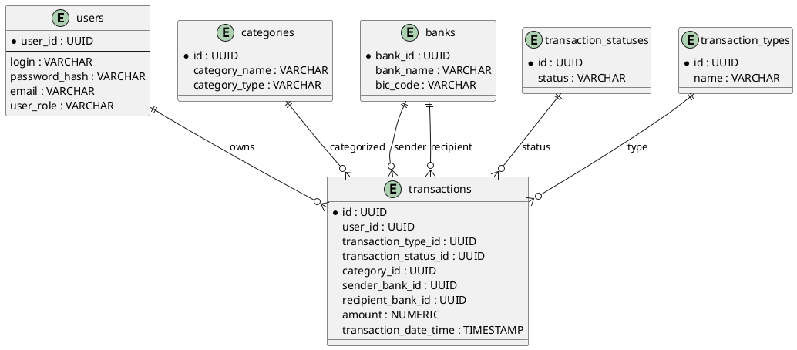
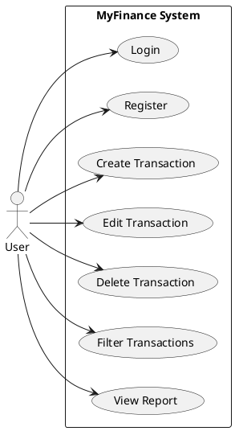
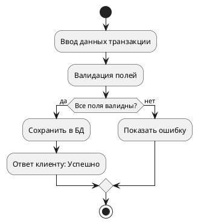

# MyFinance Application

## Цель проекта

Создание веб-приложения для мониторинга и анализа личных и бизнес-транзакций пользователей. Приложение позволяет создавать, фильтровать и отчистить транзакции с помощью UI/рест-интерфейса, а также получать аналитические отчеты.

## C4 Container Diagram (PlantUML)

```plantuml
@startuml
!includeurl https://raw.githubusercontent.com/plantuml-stdlib/C4-PlantUML/master/C4_Container.puml

Person(user, "User", "Взаимодействует через UI/клиентское приложение")

System_Boundary(system, "MyFinance Application") {
  Container(api, "REST API", "Spring Boot", "REST API для авторизации, обработки и получения транзакций")
  Container(db, "PostgreSQL DB", "PostgreSQL", "Хранит пользователей, транзакции, категории и справочники")
  Container(security, "JWT Auth Service", "Spring Security + JWT", "Обеспечивает аутентификацию и защиту API")
}

Rel(user, api, "REST запросы JSON")
Rel(api, db, "JPA/Hibernate")
Rel(api, security, "JWT Token Validation")
@enduml
```
## ERD Diagram (PlantUML)



## Use Case Diagram (PlantUML)



## BPMN: Добавление транзакции



## Основные возможности
- Регистрация и авторизация пользователей
- Создание, редактирование, удаление транзакций
- Категории доходов и расходов
- Фильтрация и поиск операций
- Генерация отчетов и аналитика

## Архитектура
- Java 21, Spring Boot 3
- Spring Security + JWT
- MapStruct для маппинга DTO
- PostgreSQL с миграциями Flyway
- Тесты с использованием Testcontainers
- Swagger/OpenAPI документация

## Запуск
```bash
./gradlew build
./gradlew bootRun
````

## Тестирование

```bash
./gradlew test
```

Проект включает комплексные тесты для репозиториев и сервисов, обеспечивающие проверку ключевой функциональности.
Тесты охватывают 100% основных сценариев работы системы, включая обработку исключительных ситуаций.

### Технологии тестирования
- **JUnit 5** - фреймворк для модульного тестирования
- **Mockito** - мокирование зависимостей
- **Testcontainers** - интеграционное тестирование с Docker
- **H2 Database** - in-memory база для изолированных тестов
- **Spring Data JPA Test** - тестирование JPA-репозиториев
- **JaCoCo** - анализ покрытия кода

### Ключевые аспекты тестирования
**Полный цикл CRUD операций** для всех сущностей:
- Валидация создания/удаления банков, категорий, пользователей
- Тестирование каскадных обновлений связанных сущностей

**Пограничные условия**:
- Обработка сумм транзакций на граничных значениях
- Валидация форматов ИНН (11 цифр), телефонов (паттерн +7XXXXXXXXXX / 7XXXXXXXXXX / 8XXXXXXXXXX) и проверка валидности Email реализованы в DTO (Data Transfer Object)

**Безопасность**:
- Проверка регистрации с дублирующимися логинами
- Тестирование хеширования паролей
- Валидация JWT токенов

**Транзакционная целостность**:
- Тесты на корректную обработку статусов транзакций
- Проверка согласованности данных при ошибках в существующий файл: # MyFinance Application

## Структура проекта

* `dto/` — DTO-объекты
* `entity/` — JPA-сущности
* `repository/` — интерфейсы доступа к данным
* `service/` — бизнес-логика
* `rest/` — REST-контроллеры
* `security/` — конфигурация и фильтры безопасности
* `mappers/` — мапперы MapStruct

## OpenAPI

Доступна по адресу: `http://localhost:8089/swagger-ui/index.html`

## Авторизация

Все запросы, кроме `/api/v1/auth/**`, требуют JWT токен в заголовке:

```http
Authorization: Bearer <jwt-token>
```

## Системные логи:

```text
2025-05-10 14:25:10.785  INFO 85432 --- [nio-8089-exec-5] o.s.web.servlet.DispatcherServlet       : Completed initialization in 12 ms
2025-05-10 14:25:11.143  INFO 85432 --- [nio-8089-exec-8] i.p.m.security.JwtAuthenticationFilter  : Token validated for user: user@example.com
2025-05-10 14:25:11.144  INFO 85432 --- [nio-8089-exec-8] i.p.m.rest.TransactionRestControllerV1  : Received POST /api/v1/transactions with payload: {amount: 1000}
2025-05-10 14:25:11.311  INFO 85432 --- [nio-8089-exec-8] i.p.m.service.TransactionService        : Transaction saved: id=82ab-01df...
2025-05-10 14:25:11.311  INFO 85432 --- [nio-8089-exec-8] i.p.m.repository.AuditTransactionRepo   : Audit INSERT entry created for transaction 82ab-01df...
2025-05-10 14:25:11.312  INFO 85432 --- [nio-8089-exec-8] o.s.web.servlet.DispatcherServlet       : Completed 200 OK in 170ms
```
